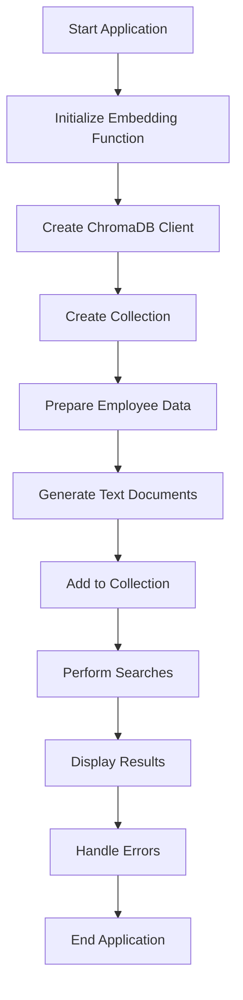

# Code Structure and Architecture

## Table of Contents
1. [Application Overview](#application-overview)
2. [Module Structure](#module-structure)
3. [Function Breakdown](#function-breakdown)
4. [Data Flow](#data-flow)
5. [Error Handling](#error-handling)
6. [Configuration](#configuration)

---

## Application Overview

The application demonstrates a complete vector similarity search system using ChromaDB and SentenceTransformers. It showcases three main capabilities:
1. **Semantic similarity search** using natural language
2. **Metadata filtering** for structured queries  
3. **Combined search** merging both approaches

### Architecture Diagram
```
┌─────────────────┐    ┌──────────────────┐    ┌─────────────────┐
│   Input Text    │───▶│ SentenceTransform│───▶│  Vector Embedding│
└─────────────────┘    └──────────────────┘    └─────────────────┘
                                                        │
                                                        ▼
┌─────────────────┐    ┌──────────────────┐    ┌─────────────────┐
│ Search Results  │◄───│   ChromaDB       │◄───│  Store in       │
└─────────────────┘    │   Collection     │    │  Collection     │
                       └──────────────────┘    └─────────────────┘
                               ▲
                               │
                       ┌──────────────────┐
                       │    Metadata      │
                       │    Filtering     │
                       └──────────────────┘
```

---

## Module Structure

### Imports and Dependencies
```python
import chromadb
from chromadb.utils import embedding_functions
```

**Purpose**: Core libraries for vector database operations and embedding generation.

### Global Configuration
```python
# Embedding function initialization
ef = embedding_functions.SentenceTransformerEmbeddingFunction(
    model_name="all-MiniLM-L6-v2"
)

# Database client
client = chromadb.Client()

# Collection identifier
collection_name = "employee_collection"
```

**Key Design Decisions**:
- **Global embedding function**: Ensures consistency across operations
- **In-memory client**: Suitable for demonstration; use PersistentClient for production
- **Descriptive collection name**: Enables easy identification and debugging

---

## Function Breakdown

### `main()` Function

#### Purpose
Primary orchestration function that sets up the complete demonstration environment.

#### Structure
```python
def main():
    try:
        # 1. Collection Creation
        # 2. Data Preparation  
        # 3. Document Generation
        # 4. Data Insertion
        # 5. Verification
        # 6. Search Demonstration
    except Exception as error:
        # Error handling
```

#### Detailed Breakdown

##### 1. Collection Creation
```python
collection = client.create_collection(
    name=collection_name,
    metadata={"description": "A collection for storing employee data"},
    configuration={
        "hnsw": {"space": "cosine"},
        "embedding_function": ef
    }
)
```

**Key Aspects**:
- **Cosine similarity**: Optimal for text embeddings
- **Metadata inclusion**: Documents the collection purpose
- **Embedding function binding**: Automatic embedding generation

##### 2. Employee Data Structure
```python
employees = [
    {
        "id": "employee_1",
        "name": "John Doe",
        "experience": 5,
        "department": "Engineering", 
        "role": "Software Engineer",
        "skills": "Python, JavaScript, React, Node.js, databases",
        "location": "New York",
        "employment_type": "Full-time"
    },
    # ... 14 more employees
]
```

**Design Principles**:
- **Consistent schema**: All employees have identical field structure
- **Diverse data**: Multiple departments, locations, and experience levels
- **Rich skills data**: Detailed skill descriptions for similarity matching
- **Realistic variety**: Represents actual organizational diversity

##### 3. Document Generation
```python
employee_documents = []
for employee in employees:
    document = f"{employee['role']} with {employee['experience']} years of experience in {employee['department']}. "
    document += f"Skills: {employee['skills']}. Located in {employee['location']}. "
    document += f"Employment type: {employee['employment_type']}."
    employee_documents.append(document)
```

**Strategy**:
- **Natural language format**: Optimized for sentence transformers
- **Comprehensive information**: Includes all searchable attributes
- **Consistent structure**: Enables predictable similarity matching
- **Contextual richness**: Provides semantic context for embeddings

##### 4. Data Insertion
```python
collection.add(
    ids=[employee["id"] for employee in employees],
    documents=employee_documents,
    metadatas=[{
        "name": employee["name"],
        "department": employee["department"],
        "role": employee["role"],
        "experience": employee["experience"],
        "location": employee["location"],
        "employment_type": employee["employment_type"]
    } for employee in employees]
)
```

**Approach**:
- **Batch operation**: Efficient bulk insertion
- **Structured metadata**: Enables complex filtering
- **ID consistency**: Maintains data relationships
- **Complete information**: All fields available for filtering

### `perform_advanced_search()` Function

#### Purpose
Demonstrates various search capabilities and edge case handling.

#### Function Signature
```python
def perform_advanced_search(collection, all_items):
```

#### Search Categories

##### 1. Similarity Search Examples
```python
# Example 1: Skill-based search
query_text = "Python developer with web development experience"
results = collection.query(
    query_texts=[query_text],
    n_results=3
)

# Example 2: Role-based search
query_text = "team leader manager with experience"
results = collection.query(
    query_texts=[query_text], 
    n_results=3
)
```

**Implementation Notes**:
- **Natural language queries**: Demonstrates semantic understanding
- **Limited results**: Focuses on top matches
- **Detailed output**: Shows similarity scores and metadata

##### 2. Metadata Filtering Examples
```python
# Department filtering
results = collection.get(
    where={"department": "Engineering"}
)

# Experience range filtering
results = collection.get(
    where={"experience": {"$gte": 10}}
)

# Location array filtering
results = collection.get(
    where={"location": {"$in": ["San Francisco", "Los Angeles"]}}
)
```

**Filtering Strategies**:
- **Exact matching**: Precise categorical filtering
- **Range queries**: Numerical comparisons
- **Array operations**: Multiple value matching
- **Efficient execution**: Database-level filtering

##### 3. Combined Search
```python
query_text = "senior Python developer full-stack"
results = collection.query(
    query_texts=[query_text],
    n_results=5,
    where={
        "$and": [
            {"experience": {"$gte": 8}},
            {"location": {"$in": ["San Francisco", "New York", "Seattle"]}}
        ]
    }
)
```

**Advanced Features**:
- **Semantic + structured**: Best of both approaches
- **Complex logic**: Multiple filtering conditions
- **Practical relevance**: Real-world search scenarios
- **Performance optimization**: Pre-filtering reduces vector search space

---

## Data Flow

### 1. Initialization Phase
```
Text Input → SentenceTransformer → Vector Embedding → ChromaDB Collection
```

### 2. Search Phase
```
Query Text → Embedding Generation → Vector Search → Metadata Filtering → Results
```

### 3. Result Processing
```
Raw Results → Distance Calculation → Metadata Extraction → Formatted Output
```

### Detailed Flow Diagram


---

## Error Handling

### Strategy
The application implements comprehensive error handling at multiple levels:

#### 1. Global Error Handling
```python
def main():
    try:
        # Main application logic
    except Exception as error:
        print(f"Error: {error}")
```

#### 2. Search-Specific Error Handling
```python
def perform_advanced_search(collection, all_items):
    try:
        # Search operations
    except Exception as error:
        print(f"Error in advanced search: {error}")
```

#### 3. Result Validation
```python
# Check for empty results
if not results or not results['ids'] or len(results['ids'][0]) == 0:
    print(f'No documents found similar to "{query_text}"')
    return
```

### Error Categories

#### 1. Collection Errors
- Collection already exists
- Invalid configuration parameters
- Embedding function failures

#### 2. Data Errors
- Invalid document format
- Missing required fields
- Type mismatches

#### 3. Search Errors
- Invalid query syntax
- Unsupported operators
- Empty result sets

#### 4. System Errors
- Memory limitations
- Network connectivity (for model downloads)
- File system permissions

---

## Configuration

### Environment Configuration
```python
# Development Configuration
client = chromadb.Client()  # In-memory

# Production Configuration  
client = chromadb.PersistentClient(
    path="./chroma_db",
    settings=Settings(
        chroma_server_host="localhost",
        chroma_server_http_port=8000
    )
)
```

### Collection Configuration
```python
configuration = {
    "hnsw": {
        "space": "cosine",        # Distance metric
        "M": 16,                  # Max connections per node
        "ef_construction": 200,   # Build-time search depth
        "ef": 10,                # Query-time search depth
        "max_elements": 10000    # Maximum elements
    }
}
```

### Embedding Configuration
```python
# Model selection based on requirements
models = {
    "fast": "all-MiniLM-L6-v2",      # 384 dimensions, ~90MB
    "balanced": "all-mpnet-base-v2",  # 768 dimensions, ~420MB  
    "multilingual": "paraphrase-multilingual-MiniLM-L12-v2"
}
```

---

## Performance Considerations

### Memory Usage
- **Embedding Model**: ~90MB for all-MiniLM-L6-v2
- **Collection Data**: ~1KB per document + embeddings
- **Index Overhead**: Depends on HNSW parameters

### Query Performance
- **Simple Queries**: < 10ms for small collections
- **Complex Filters**: < 50ms with proper indexing
- **Batch Operations**: 100x faster than individual queries

### Scalability Factors
- **Collection Size**: Linear memory growth
- **Embedding Dimensions**: Affects storage and computation
- **HNSW Parameters**: Trade-off between speed and accuracy

---

## Code Quality Features

### 1. Comprehensive Documentation
- Detailed comments explaining each operation
- Function-level documentation
- Inline explanations for complex logic

### 2. Modular Design
- Separation of concerns between functions
- Reusable components
- Clear interfaces between modules

### 3. Error Resilience
- Multiple levels of error handling
- Graceful degradation
- Informative error messages

### 4. Extensibility
- Easy to add new search types
- Configurable parameters
- Pluggable embedding functions

### 5. Maintainability
- Clear variable naming
- Consistent code style
- Logical code organization

---

This architecture provides a solid foundation for building production-ready vector search applications while maintaining clarity and educational value.
